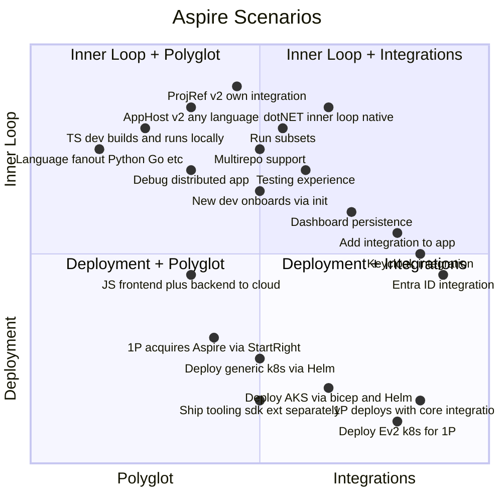

# Aspire Scenarios

## Scenario Map

## Scenario Details

| ID | Scenario | Quadrants | Issues | Key Work Items | Customer Delighters | Risks |
|----|----------|-----------|--------|----------------|---------------------|-------|
| S1 | TS dev builds & runs locally | Polyglot, Inner Loop | 89 | missing TS exports, defining TS runtime support, TS doc overhaul, alternate package managers and runtimes (yarn, bun) for apphost and integrations | TS/JS devs get first-class Aspire without touching .NET | TS API surface area churn, parity gap with .NET features, fragmentation across package managers and runtimes |
| S2 | .NET dev inner loop feels native | Inner Loop | 21 | e2e with dotnet feels as fast as TS (watch, project refs) | Hot reload and watch just work, no restart tax | Complex msbuild interactions, regression risk in watch/reload |
| S3 | Add integration to existing app | Integrations, Polyglot | 11 | aspire add 3rd party integrations, templates (new) | One command to add any integration | 3rd party quality control, breaking changes in community packages |
| S4a | Deploy generic k8s via Helm | Deployment | 36 | Helm chart gen, generic k8s publish | `aspire publish` produces production-ready Helm charts | Wide k8s version matrix, Helm chart correctness across distros |
| S4b | Deploy AKS via bicep + Helm | Deployment, Integrations | 11 | AKS bicep provisioning, Helm chart gen | Zero-to-AKS with infra provisioning included | AKS API versioning, bicep breaking changes |
| S4c | Deploy Ev2 k8s for 1P | Deployment, Integrations | 0 | Ev2 integration, internal deployment pipeline | 1P teams deploy via Ev2 without hand-rolling manifests | Ev2 dependency on internal team, limited external testability |
| S4d | Deploy infra (non-k8s) | Deployment, Infra | 141 | GH Actions pipeline gen, installers, split SDK+tooling | CI/CD pipeline generated from app model | GH Actions API changes, installer platform matrix |
| S5 | New dev onboards with aspire init | Inner Loop, Integrations, Polyglot | 71 | aspire init, templates (new) | Existing app becomes Aspire app in minutes | Huge variety of existing app shapes, hard to cover all cases |
| S6 | Debug replat | Inner Loop, Polyglot | 26 | aspire debug router: agents, debug .NET in containers, cross-language debug attach | Attach debugger across services and containers seamlessly | Multi-process debugging is inherently fragile, IDE coupling, container runtime differences |
| S7 | 1P deploys with core integrations | Deployment, Integrations | 6 | AFD, Geneva, finish VNets/network perimeters, Entra ID, APIM, Event Grid | Enterprise networking, monitoring, identity, API management out of the box | Dependency on partner teams for AFD/Geneva/Entra/APIM, compliance scope |
| S8 | 1P acquires Aspire via StartRight | Deployment, Polyglot | 20 | StartRight integration, acquisition flow | Teams discover and adopt Aspire through existing compliance tooling | StartRight roadmap alignment, adoption funnel drop-off |
| S9 | JS frontend + backend deployed to cloud | Polyglot, Deployment, Integrations | 9 | JS/TS frontend, any backend, container resource (DB), cloud deploy | Full-stack JS app with a DB, local to cloud, no YAML | End-to-end surface area is large, many failure points across stack |
| S10 | ProjRef v2: own integration | Inner Loop, Polyglot | 10 | Move AddProject into its own integration, remove apphost SDK, remove reliance on implicit usings | Simpler apphost project, less magic, easier to understand | Breaking change for existing users, migration effort |
| S11 | AppHost v2: any language apphost | Inner Loop, Polyglot | 0 | AppHost and integrations can be written in any language, build owned by apphost not msbuild, uses bundle like guest langs, everything through AddCsharpApp | Write your apphost and integrations in whatever language your team knows | Massive architectural change, long tail of compat issues |
| S12 | Language fanout: Python, Go, etc | Polyglot | 6 | Python apphost, Go apphost, additional guest language SDKs, language-specific integration authoring | Aspire meets devs where they are, not just TS and .NET | Staffing for each language SDK, keeping parity across all |
| S13 | Ship tooling, SDK, extension separately | Infra | 71 | Decouple CLI tooling, SDK packages, and VS Code extension release trains, independent versioning and install | Teams pick up fixes and features without waiting for a monolithic release | Version compat matrix, harder to test combinations |
| S14 | Multirepo support | Inner Loop, Polyglot, Integrations | 1 | AppHost orchestrates services across multiple repos, cross-repo service discovery and references | Teams own their services in separate repos and still get the full Aspire experience | Repo boundary complexity, auth/cloning, keeping local dev fast across repos |
| S15 | Testing experience | Inner Loop, Integrations | 45 | Live dashboard during tests, capture and replay, partial apphost execution, request mocking, code coverage | Devs test distributed apps with the same confidence as unit tests | Scope is massive, testing distributed systems is inherently hard |
| S16 | Dashboard persistence | Inner Loop, Integrations | 8 | External storage for telemetry, persistent observability across restarts | Telemetry survives restarts, shareable across team | Storage backend choice, performance at scale, data retention policy |
| S17 | Run subsets | Inner Loop | 3 | Run only selected resources from apphost, partial startup | Large apps start fast by running only what you need | Dependency graph correctness, UX for selecting subsets |
| S18 | Entra ID integration | Integrations | 13 | Entra ID auth for resources, managed identity, RBAC | Enterprise auth just works out of the box | AAD complexity, token lifecycle, multi-tenant scenarios |
| S19 | Keycloak integration | Integrations | 9 | Keycloak container resource, realm config, OIDC setup | Open-source auth story for non-Azure teams | Keycloak version churn, config complexity |

---

*Iterate: add/rename/merge/split scenarios, reassign quadrants, add work items*

*607 of 1,686 open issues mapped to scenarios. 1,079 are general bugs/enhancements not specific to a scenario.*

## Related Issues

<strong>S1: TS dev builds & runs locally</strong> (89 issues)

- [#969](https://github.com/microsoft/aspire/issues/969) Support running and debugging Aspire service projects in Containers
- [#1492](https://github.com/microsoft/aspire/issues/1492) Host Run Targets for jobs versus/web sites and no debugger by default with EASY attach to debug
- [#2658](https://github.com/microsoft/aspire/issues/2658) Allow better modeling of external endpoints to enable resources to reference each other's non-external vs. external endpoints
- [#4297](https://github.com/microsoft/aspire/issues/4297) Add tests that validate that playground app manifests are not broken
- [#4409](https://github.com/microsoft/aspire/issues/4409) Bug - Defaulting $(Platform) to Any CPU causes tests to hang indefinitely / time out.
- [#5537](https://github.com/microsoft/aspire/issues/5537) Parameters in User Secrets containing `&` are converted to contain `\\u0026` instead
- [#6615](https://github.com/microsoft/aspire/issues/6615) IResourceWithParent not supported with projects and executables
- [#6640](https://github.com/microsoft/aspire/issues/6640) Requests not balanced across replicas when using WithReplicas(2)
- [#6659](https://github.com/microsoft/aspire/issues/6659) Address in use error gets double logged
- [#6680](https://github.com/microsoft/aspire/issues/6680) NodeJs app in GitHub Codespaces missing environment variable with hyphen
- [#7069](https://github.com/microsoft/aspire/issues/7069) Allow specifying MSBuild arguments to build project resources for in publish mode
- [#7923](https://github.com/microsoft/aspire/issues/7923) Failing Aspire.Hosting tests on Windows for PR validation
- [#8884](https://github.com/microsoft/aspire/issues/8884) aspire samples: javascript
- [#8893](https://github.com/microsoft/aspire/issues/8893) AppHost secrets.json Gets reformatted/inconsistent formatting with duplicate keys breaking local dev
- [#9043](https://github.com/microsoft/aspire/issues/9043) Add replayable events on eventing.
- [#9047](https://github.com/microsoft/aspire/issues/9047) Executable Arguments on dashboard show raw manifest expression
- [#9449](https://github.com/microsoft/aspire/issues/9449) Support complex objects as parameter types
- [#9735](https://github.com/microsoft/aspire/issues/9735) Aspire use its own build configuration name for the project resources
- [#9999](https://github.com/microsoft/aspire/issues/9999) Aspire AppHost/dashboard defaults no longer seem to apply
- [#10002](https://github.com/microsoft/aspire/issues/10002) Aspire does not support using multiple projects with same name
- [#10524](https://github.com/microsoft/aspire/issues/10524) Follow up on comments from PR 10493
- [#10921](https://github.com/microsoft/aspire/issues/10921) ExpressionResolver should throw when resolving endpoints that do not have AllocatedEndpoint infomration.
- [#11541](https://github.com/microsoft/aspire/issues/11541) Document the way of sharing code between AppHost and its referenced projects
- [#11550](https://github.com/microsoft/aspire/issues/11550) Windows ARM64: Health checks are performed over IPv6 only, while docker defaults to IPv4
- [#12241](https://github.com/microsoft/aspire/issues/12241) Creation of DCP Service object times out (was: Allow configuration of timeouts for KubernetesService)
- [#12247](https://github.com/microsoft/aspire/issues/12247) `dotnet run` fails with "address already in use" for fixed external ports via `.WithEndpoint`
- [#12598](https://github.com/microsoft/aspire/issues/12598) Container image for JavaScript apps are huge
- [#12624](https://github.com/microsoft/aspire/issues/12624) Optimize node docker file
- [#12834](https://github.com/microsoft/aspire/issues/12834) Add OTEL HTTP support for JS client apps
- [#13035](https://github.com/microsoft/aspire/issues/13035) Generate IProjectMetadata types even when not referencing projects from the AppHost
- [#13095](https://github.com/microsoft/aspire/issues/13095) Intercept HTTP requests for observability
- [#13451](https://github.com/microsoft/aspire/issues/13451) Add Rush as a package manager
- [#13597](https://github.com/microsoft/aspire/issues/13597) Support setting resource endpoint ports from AppHost config & persist random assignments to user secrets
- [#13625](https://github.com/microsoft/aspire/issues/13625) `AddViteApp` with `WithHttpsDeveloperCertificate` will silently skip HTTPS setup if Vite config is missing
- [#13640](https://github.com/microsoft/aspire/issues/13640) Should `GenerateParameterDefault` regenerate if stored value no longer meets complexity requirements?
- [#13714](https://github.com/microsoft/aspire/issues/13714) Pits of failure using `WaitForResourceHealthyAsync` in tests.
- [#13907](https://github.com/microsoft/aspire/issues/13907) Node app build output files
- [#14061](https://github.com/microsoft/aspire/issues/14061) Urls for endpoints on other resources render inconsistently
- [#14416](https://github.com/microsoft/aspire/issues/14416) Add Yarn and Pnpm workspaces support
- [#14603](https://github.com/microsoft/aspire/issues/14603) aspire-samples tests are failing on latest docker update
- [#14828](https://github.com/microsoft/aspire/issues/14828) Polyglot ConfigureInfrastructure for Azure resources
- [#14880](https://github.com/microsoft/aspire/issues/14880) Aspire.Hosting.JavaScript - WithPnpm fails when using Scoop-installed pnpm
- [#14887](https://github.com/microsoft/aspire/issues/14887) Consider emitting TypeScript APIs at build time
- [#14911](https://github.com/microsoft/aspire/issues/14911) Generate custom API docs for polyglot SDKs
- [#14939](https://github.com/microsoft/aspire/issues/14939) PublishAsDockerFile() ignores DockerfileContext MSBuild property — Docker build context defaults to project directory instead of solution root
- [#14952](https://github.com/microsoft/aspire/issues/14952) `OnBeforeResourceStart` events fired out of order
- [#15101](https://github.com/microsoft/aspire/issues/15101) Create the TypeScript equivalent to Aspire.Hosting.Test
- [#15104](https://github.com/microsoft/aspire/issues/15104) We expose withEnvironmentCallback and withEnvironmentCallbackAsync
- [#15119](https://github.com/microsoft/aspire/issues/15119) Bad error when integration doesn't support AspireExport
- [#15120](https://github.com/microsoft/aspire/issues/15120) Yarp addCluster(EndpointReference) doesn't work in polyglot
- [#15122](https://github.com/microsoft/aspire/issues/15122) aspire init should augment existing package.json for brownfield TypeScript apphosts
- [#15190](https://github.com/microsoft/aspire/issues/15190) Multiple AddCSharpApp calls to projects in the same repo can cause build contention
- [#15219](https://github.com/microsoft/aspire/issues/15219) Add the resource name to "Capability error" messages
- [#15282](https://github.com/microsoft/aspire/issues/15282) Aspire polyglot should enable nuget signature verification on Linux
- [#15290](https://github.com/microsoft/aspire/issues/15290) [Blog post] Add Aspire 13.2 post for Bun support and container enhancements
- [#15303](https://github.com/microsoft/aspire/issues/15303) Guide polyglot users in the right direction
- [#15320](https://github.com/microsoft/aspire/issues/15320) Polyglot-Compatible Integration Discovery
- [#15399](https://github.com/microsoft/aspire/issues/15399) Polyglot (guest) AppHost restore does not isolate staging NuGet packages from global cache
- [#15412](https://github.com/microsoft/aspire/issues/15412) Replace SHA-256 with non-cryptographic hash for socket/pipe path naming
- [#15448](https://github.com/microsoft/aspire/issues/15448) apphost.ts `aspire publish` goes to ~/.aspire/bundle-hosts
- [#15486](https://github.com/microsoft/aspire/issues/15486) TypeScript AppHost: invalid endpoint name in getEndpoint()/withEnvironmentEndpoint() can cause silent FailedToStart with no diagnostics
- [#15489](https://github.com/microsoft/aspire/issues/15489) TypeScript AppHost Node process does not trust dev certs
- [#15509](https://github.com/microsoft/aspire/issues/15509) Kusto tests failing on CI
- [#15523](https://github.com/microsoft/aspire/issues/15523) Multiple AppHosts with the same port report they launch successfully at the same time
- [#15539](https://github.com/microsoft/aspire/issues/15539) `aspire deploy` with typescript apphost should have better default Azure Resource Group
- [#15550](https://github.com/microsoft/aspire/issues/15550) template should indicate TS apphost [Starter App (Express/React)]
- [#15581](https://github.com/microsoft/aspire/issues/15581) Aspire doesn't add development certificate to dev-certs storage
- [#15623](https://github.com/microsoft/aspire/issues/15623) aspire new/run from workspace root uses root aspire.config.json (no packages) instead of project config
- [#15687](https://github.com/microsoft/aspire/issues/15687) Infer AspireUnion metadata from C# union types in exported APIs
- [#15700](https://github.com/microsoft/aspire/issues/15700) Error message for port conflicts of dependencies is logged at a to low level
- [#15703](https://github.com/microsoft/aspire/issues/15703) [ResourceName] could be an annotation on ATS exports
- [#15734](https://github.com/microsoft/aspire/issues/15734) Create [AspireExportObsolete]
- [#15782](https://github.com/microsoft/aspire/issues/15782) aspire otel commands fail with 'No such host is known' when using *.dev.localhost URLs (TypeScript AppHost)
- [#15785](https://github.com/microsoft/aspire/issues/15785) TypeScript codegen does not reliably pick up new integrations added via aspire add
- [#15812](https://github.com/microsoft/aspire/issues/15812) Support alternative JavaScript runtimes (Bun, Deno) for TypeScript AppHosts
- [#15813](https://github.com/microsoft/aspire/issues/15813) [Feature Request] Enable Go-based Polyglot AppHost (apphost.go) via JSON-RPC
- [#15831](https://github.com/microsoft/aspire/issues/15831) [Failing test]: Aspire.Cli.EndToEnd.Tests.ProjectReferenceTests.TypeScriptAppHostWithProjectReferenceIntegration
- [#15852](https://github.com/microsoft/aspire/issues/15852) TypeScript apphost scaffold: tsconfig.apphost.json not discovered by typescript-eslint project service
- [#15853](https://github.com/microsoft/aspire/issues/15853) AddViteApp HTTPS config injection fails in yarn workspaces monorepos (node_modules hoisting)
- [#15858](https://github.com/microsoft/aspire/issues/15858) WithDockerfileBuilder not available in polyglot apphosts, and no publishAsDockerfile metho exists
- [#15868](https://github.com/microsoft/aspire/issues/15868) EndpointPropertyExpression not exported/available in TypeScript SDK
- [#15877](https://github.com/microsoft/aspire/issues/15877) Auto-generated Dockerfiles break yarn/npm workspaces monorepos
- [#15902](https://github.com/microsoft/aspire/issues/15902) Add @internal JSDoc tags to generated *Impl and *PromiseImpl classes
- [#15967](https://github.com/microsoft/aspire/issues/15967) Store polyglot AppHost restore artifacts under the workspace instead of ~/.aspire/packages/restore
- [#16015](https://github.com/microsoft/aspire/issues/16015) AddViteApp doesn't add pnpm-workspace.yaml in the docker context
- [#16026](https://github.com/microsoft/aspire/issues/16026) Add runtime unit tests for generated TypeScript transport code (trackPromise/flushPendingPromises)
- [#16032](https://github.com/microsoft/aspire/issues/16032) Unify E2E test helpers: centralized error handling, logging, and resource assertions
- [#16121](https://github.com/microsoft/aspire/issues/16121) CLI: TypeScript AppHost hardcodes npm install, ignoring packageManager field
- [#16124](https://github.com/microsoft/aspire/issues/16124) CLI: TypeScript AppHost top-level await fails in brownfield repos without type:module

<strong>S2: .NET dev inner loop feels native</strong> (21 issues)

- [#4582](https://github.com/microsoft/aspire/issues/4582) Watch task over kubernetes Container resources terminated unexpectedly. Check to ensure dcpd process is running.
- [#4981](https://github.com/microsoft/aspire/issues/4981) Cannot rebuild projects due to exe file being locked
- [#7112](https://github.com/microsoft/aspire/issues/7112) Use new 'dotnet run' 9.1 options for launching projects
- [#7695](https://github.com/microsoft/aspire/issues/7695) Only rebuild / restart impacted resources when hot reload cannot be used (while debugging)
- [#8077](https://github.com/microsoft/aspire/issues/8077) WaitFor compatibility with Node watch processes (non-exiting background process)
- [#9450](https://github.com/microsoft/aspire/issues/9450) Aspire CLI --watch large environment variables
- [#9756](https://github.com/microsoft/aspire/issues/9756) WaitForCompletion seems incompatible with watch
- [#11072](https://github.com/microsoft/aspire/issues/11072) Rebuild & Restart aspire project when restarting from aspire dashboard
- [#12778](https://github.com/microsoft/aspire/issues/12778) `aspire run` for file-based AppHost doesn't rebuild project references
- [#12970](https://github.com/microsoft/aspire/issues/12970) `dotnet watch` on apphost does not start azure functions project
- [#13142](https://github.com/microsoft/aspire/issues/13142) aspire run hangs on build errors when using defaultWatchEnabled
- [#13207](https://github.com/microsoft/aspire/issues/13207) Should AddCsharpApp with defaultWatchEnabled require a project reference or not?
- [#13738](https://github.com/microsoft/aspire/issues/13738) [AspireE2E] When I run the aspire project again with .WithReplicas(2) added using dotnet watch, the project fails to run successfully.
- [#13839](https://github.com/microsoft/aspire/issues/13839) Apphost Hot Reload Architecture for `aspire run`
- [#13924](https://github.com/microsoft/aspire/issues/13924) Request for the hot reload on Aspire CLI similar as 'dotnet watch' kind of functionality
- [#13928](https://github.com/microsoft/aspire/issues/13928) [AspireE2E] When dotnet watch on Aspire Starter App (ASP.NET Core/Blazor) app, The dotnet watch information displays incorrect after editing the file
- [#13929](https://github.com/microsoft/aspire/issues/13929) [AspireE2E][Aspire CLI]An unexpected error occurred: The JSON-RPC connection with the remote party was lost before the request could complete when dotnet watch on Aspire AppHost project
- [#14514](https://github.com/microsoft/aspire/issues/14514) Improve Kubernetes watch errors
- [#15109](https://github.com/microsoft/aspire/issues/15109) Solution build in Visual Studio stops AppHost instead of restarting it
- [#15710](https://github.com/microsoft/aspire/issues/15710) Aspire watch experience
- [#15850](https://github.com/microsoft/aspire/issues/15850) VS Code: `Run with aspire` doesn't rebuilt app host if out of date

<strong>S3: Add integration to existing app</strong> (11 issues)

- [#8159](https://github.com/microsoft/aspire/issues/8159) `aspire add` should give next steps when package is installed.
- [#8369](https://github.com/microsoft/aspire/issues/8369) `aspire add` only supports adding hosting integrations
- [#9492](https://github.com/microsoft/aspire/issues/9492) Aspire CLI - show tags on aspire add
- [#10975](https://github.com/microsoft/aspire/issues/10975) Aspire CLI - Add to existing solution
- [#11689](https://github.com/microsoft/aspire/issues/11689) Add support for aspire add to create proj references
- [#13808](https://github.com/microsoft/aspire/issues/13808) Easy way to add service defaults from CLI
- [#14799](https://github.com/microsoft/aspire/issues/14799) Can't add Testing package via `aspire add`
- [#15263](https://github.com/microsoft/aspire/issues/15263) Smooth rough edges when publishing integration packages
- [#15396](https://github.com/microsoft/aspire/issues/15396) aspire add --version should not prompt for a version
- [#15632](https://github.com/microsoft/aspire/issues/15632) in aspire.config.json, "packages" should be renamed "integrations"
- [#15880](https://github.com/microsoft/aspire/issues/15880) aspire add: support non-interactive search/filter for hosting integrations

<strong>S4a: Deploy generic k8s via Helm</strong> (36 issues)

- [#2515](https://github.com/microsoft/aspire/issues/2515) Kubernetes DnsSrv service discovery across namespace
- [#4054](https://github.com/microsoft/aspire/issues/4054) FEATURE: Kubernetes Probes - Sidecar - Source Generator
- [#5420](https://github.com/microsoft/aspire/issues/5420) Expose default health endpoints for Kubernetes probes
- [#8028](https://github.com/microsoft/aspire/issues/8028) ObjectDisposedException in Dcp.KubernetesService.EnsureKubernetesAsync
- [#9097](https://github.com/microsoft/aspire/issues/9097) Improve error reporting from Kubernetes Publisher
- [#9226](https://github.com/microsoft/aspire/issues/9226) Fix port mapping for bait and switch resources in Kubernetes
- [#9429](https://github.com/microsoft/aspire/issues/9429) Ability to create PVC without defining a PV
- [#9430](https://github.com/microsoft/aspire/issues/9430) Ability to define a PVC or use WithVolume on a ProjectResource
- [#9431](https://github.com/microsoft/aspire/issues/9431) Ability to override values in the helm values.yaml file.
- [#9605](https://github.com/microsoft/aspire/issues/9605) Add dashboard support for KubernetesEnvironmentResource
- [#9613](https://github.com/microsoft/aspire/issues/9613) Add support for Azure Kubernetes Service
- [#9767](https://github.com/microsoft/aspire/issues/9767) More customization for PublishAsKubernetesService()
- [#9913](https://github.com/microsoft/aspire/issues/9913) Aspir8 and resolving service endpoints in kubernetes with DNS SRV
- [#10994](https://github.com/microsoft/aspire/issues/10994) aspire publish produces invalid helm configuration for database secrets
- [#11140](https://github.com/microsoft/aspire/issues/11140) Aspire Cli K8s Build WithEnvironment() Values all missing in values.yaml
- [#11183](https://github.com/microsoft/aspire/issues/11183) Bug: aspire publish kubernetes Fails with Duplicate Endpoint Names and Port Resolution Errors
- [#11332](https://github.com/microsoft/aspire/issues/11332) HorizontalPodAutoscalerV2 generates invalid metrics block in Kubernetes manifest
- [#11365](https://github.com/microsoft/aspire/issues/11365) Feature Request: Remove values.yaml in Aspire Kubernetes Publish and Inline Configuration in ConfigMaps and Services.
- [#11383](https://github.com/microsoft/aspire/issues/11383) request feature : Add default namespace for all Kubernetes resources & auto‑PVC creation for resources with DefaultStorageClassName
- [#12562](https://github.com/microsoft/aspire/issues/12562) Question: Kubernetes publish support does not build or push containers to registry
- [#13365](https://github.com/microsoft/aspire/issues/13365) Error on aspire publish when combining Kubernetes and NATS integrations
- [#13871](https://github.com/microsoft/aspire/issues/13871) Errors discovered in K8s service
- [#14011](https://github.com/microsoft/aspire/issues/14011) .WithContainerRegistry has no effect when deploying to Kubernetes
- [#14096](https://github.com/microsoft/aspire/issues/14096) (code provided): Kubernetes integration: specifying pvc as default storage type generates invalid YAML assets
- [#14370](https://github.com/microsoft/aspire/issues/14370) Kubernetes publisher: cross-resource secret references generate broken Helm value paths
- [#14389](https://github.com/microsoft/aspire/issues/14389) K8s publisher: Helm secret value path mismatch between template expression and values.yaml
- [#14506](https://github.com/microsoft/aspire/issues/14506) Create Production grade Postgres Integration for K8s by integrating with cloudnative-pg
- [#14579](https://github.com/microsoft/aspire/issues/14579) Two BaseKubernetesResource with same Metadata.Name and then when running aspire publish the two resources overrides each other
- [#15021](https://github.com/microsoft/aspire/issues/15021) Helm manifests not generating initContainers correctly in Kubernetes
- [#15229](https://github.com/microsoft/aspire/issues/15229) Kubernetes publisher fails with Unsupported value type: Boolean for Scalar env vars
- [#15789](https://github.com/microsoft/aspire/issues/15789) NATS container args incompatible with Kubernetes publishing - Command line args must be strings
- [#15795](https://github.com/microsoft/aspire/issues/15795) AddDatabase() databases are not created when deploying to Kubernetes
- [#15870](https://github.com/microsoft/aspire/issues/15870) [Failing test]: Aspire.Cli.EndToEnd.Tests.KubernetesPublishTests.CreateAndPublishToKubernetes
- [#16099](https://github.com/microsoft/aspire/issues/16099) aspire destroy: Helm uninstall should throw on non-zero exit code
- [#16101](https://github.com/microsoft/aspire/issues/16101) IHelmRunner: Add typed methods for deploy, uninstall, verify
- [#16114](https://github.com/microsoft/aspire/issues/16114) Kubernetes Helm chart generation fails when resources reference Azure Bicep outputs

<strong>S4b: Deploy AKS via bicep + Helm</strong> (11 issues)

- [#6939](https://github.com/microsoft/aspire/issues/6939) Launching with AppHost adds OTEL_EXPORTER_OTLP_PROTOCOL=grpc environment variable which breaks exporting to Seq
- [#7188](https://github.com/microsoft/aspire/issues/7188) global.json override breaks azure function
- [#7370](https://github.com/microsoft/aspire/issues/7370) Add Seq client Integration into an app with NSwag breaks the app.
- [#7685](https://github.com/microsoft/aspire/issues/7685) Aspire.Hosting.Azure.AppContainers breaks Qdrant Integration (ACA)
- [#8306](https://github.com/microsoft/aspire/issues/8306) Add options argument to `IContainerRuntime` to allow tweaks to the way the image is generated.
- [#10823](https://github.com/microsoft/aspire/issues/10823) Adding a parent relationship to a container resource breaks `.WaitForCompletion()`
- [#11775](https://github.com/microsoft/aspire/issues/11775) using AddAzureFunctionsProject() in conjunction with openapi for azure functions breaks swagger ui
- [#15476](https://github.com/microsoft/aspire/issues/15476) Aspire CLI `aspire update` breaks project with Central Package Management (13.1.3)
- [#15620](https://github.com/microsoft/aspire/issues/15620) CosmosDB preview emulator: HTTPS endpoint switch ignores certificate availability, breaks CI
- [#15845](https://github.com/microsoft/aspire/issues/15845) Plain `aspire logs` / telemetry output leaks ANSI fragments
- [#16107](https://github.com/microsoft/aspire/issues/16107) aspire start --isolated breaks resource telemetry

<strong>S4c: Deploy Ev2 k8s for 1P</strong> (0 issues)

No issues mapped yet.

<strong>S4d: Deploy infra (non-k8s)</strong> (141 issues)

- [#2711](https://github.com/microsoft/aspire/issues/2711) Consider deployment story for static web apps/spa
- [#2866](https://github.com/microsoft/aspire/issues/2866) Add support for Azure Container Apps "init containers"
- [#3121](https://github.com/microsoft/aspire/issues/3121) Infrastructure versioning with CDK callbacks
- [#3407](https://github.com/microsoft/aspire/issues/3407) Include a healthcheck binary for use in a docker compose environment
- [#4341](https://github.com/microsoft/aspire/issues/4341) Deploy on Multiple Server with Control, Master-Slave database support
- [#4405](https://github.com/microsoft/aspire/issues/4405) Validate Sql database names that will get converted at deployment
- [#4733](https://github.com/microsoft/aspire/issues/4733) .NET Aspire application deployed to Azure Container App does not communicate over HTTP/2
- [#5178](https://github.com/microsoft/aspire/issues/5178) Ability to set ASPNETCORE_ENVIRONMENT while executing azd up / azd deploy 
- [#6559](https://github.com/microsoft/aspire/issues/6559) Support of .net aspire deployment using terraform
- [#6667](https://github.com/microsoft/aspire/issues/6667) Configure Environment of AppHost in Publish Mode
- [#6781](https://github.com/microsoft/aspire/issues/6781) Unable to deploy Blazor wasm project to Aspire
- [#7330](https://github.com/microsoft/aspire/issues/7330) Aspire incorrectly merges Azurite emulator bindings into production manifest, causing Bicep failure
- [#7829](https://github.com/microsoft/aspire/issues/7829) Disable Custom Domain validation on deployment
- [#8063](https://github.com/microsoft/aspire/issues/8063) Windows Container Support
- [#8208](https://github.com/microsoft/aspire/issues/8208) Support docker healthchecks
- [#8262](https://github.com/microsoft/aspire/issues/8262) `azd pipeline config` is not asking for all parameters from Aspire app host
- [#8748](https://github.com/microsoft/aspire/issues/8748) Publishing Docker image for project resource to GitHub fails due to ContainerRepository
- [#8805](https://github.com/microsoft/aspire/issues/8805) Improve handling of `azd deploy` auth errors
- [#8842](https://github.com/microsoft/aspire/issues/8842) Add ability to configure container image when publishing by docker compose publisher
- [#8939](https://github.com/microsoft/aspire/issues/8939) ACA Container volumes use shared access keys
- [#9019](https://github.com/microsoft/aspire/issues/9019) Debug publish mode
- [#9094](https://github.com/microsoft/aspire/issues/9094) Support existing ACA environment resource
- [#9194](https://github.com/microsoft/aspire/issues/9194) .WaitFor() not working for databases with Docker Compose Publisher
- [#9281](https://github.com/microsoft/aspire/issues/9281) Publishing to docker compose fails for a project with multiple RuntimeIdentifiers
- [#9299](https://github.com/microsoft/aspire/issues/9299) Publishers should emit assets to a separate directory
- [#9410](https://github.com/microsoft/aspire/issues/9410) Compose publish doesn't apply ownership for `ContainerFileSystemCallbackAnnotation` with existing files
- [#9651](https://github.com/microsoft/aspire/issues/9651) Make endpoints work across different compute environments
- [#9711](https://github.com/microsoft/aspire/issues/9711) Docker compose publisher doesn't take into account overridden image name for ProjectResource when generating .env file
- [#9824](https://github.com/microsoft/aspire/issues/9824) Postgres does not work with volumes when hosted on ACA
- [#9852](https://github.com/microsoft/aspire/issues/9852) Specify container registries for Aspire Publish - CICD
- [#9905](https://github.com/microsoft/aspire/issues/9905) Publishing docker compose fails if ProjectResource is excluded from manifest
- [#9914](https://github.com/microsoft/aspire/issues/9914) Allow change publish output path for a specific resource
- [#9932](https://github.com/microsoft/aspire/issues/9932) Customizing image names and tags when deploying with azd in Aspire
- [#9954](https://github.com/microsoft/aspire/issues/9954) Conflict between revisions using .WithDataVolume() and Qdrant integration in Azure Container Apps
- [#10039](https://github.com/microsoft/aspire/issues/10039) Customizing container CPU/Memory with .PublishAsAzureContainerApp() causes environment variables to break
- [#10212](https://github.com/microsoft/aspire/issues/10212) Default ContainerRuntimeIdentifier to linux-x64 in ResourceContainerImageBuilder
- [#10492](https://github.com/microsoft/aspire/issues/10492) Implement parameter descriptions in all relevant locations
- [#10693](https://github.com/microsoft/aspire/issues/10693) Default App container deployment encoded secrets
- [#10694](https://github.com/microsoft/aspire/issues/10694) Deploy container only solution
- [#10778](https://github.com/microsoft/aspire/issues/10778) Add EnableHostBindingPlaceholders flag to DockerComposeEnvironmentResource for host resource substitution
- [#10784](https://github.com/microsoft/aspire/issues/10784) Aspire.Hosting.Docker - Product Volumes aren't mapped properly.
- [#11033](https://github.com/microsoft/aspire/issues/11033) Implement GetValueAsync API on ContainerPortReference for build output port resolution
- [#11061](https://github.com/microsoft/aspire/issues/11061) Define interface for resolving deployment environment domain
- [#11086](https://github.com/microsoft/aspire/issues/11086) Add support for BYO certificate with `ConfigureCustomDomain(...)`
- [#11096](https://github.com/microsoft/aspire/issues/11096) [META]: Azure Container Apps support
- [#11124](https://github.com/microsoft/aspire/issues/11124) 📝Add Aspire CLI option to publish output file without building container images
- [#11201](https://github.com/microsoft/aspire/issues/11201) Docker compose env interpolation support
- [#11209](https://github.com/microsoft/aspire/issues/11209) Feature: SSH + Docker Compose remote deployment pipeline with automatic TLS and YARP ingress
- [#11269](https://github.com/microsoft/aspire/issues/11269) Provide API for deployment resources that product and push build artifacts
- [#11271](https://github.com/microsoft/aspire/issues/11271) Custom Domain should update bicep
- [#11407](https://github.com/microsoft/aspire/issues/11407) ACA Container App Jobs break when launchSettings has kestrel settings
- [#11408](https://github.com/microsoft/aspire/issues/11408) aspire deploy requires docker to be running, but azd up doesn't
- [#11443](https://github.com/microsoft/aspire/issues/11443) Add `WithBuildSecret` overload that accepts a file path
- [#11487](https://github.com/microsoft/aspire/issues/11487) DistributedApplicationRunner unconditionally completes publish
- [#11501](https://github.com/microsoft/aspire/issues/11501) `aspire deploy` can hang on Docker health check if daemon is busy
- [#11517](https://github.com/microsoft/aspire/issues/11517) Aspire CLI - `aspire deploy` filter Azure subs/locs
- [#11542](https://github.com/microsoft/aspire/issues/11542) Docker Compose Image Tag for Projects
- [#11605](https://github.com/microsoft/aspire/issues/11605) Error Deploying .NET Aspire ViteApp Using azd in Azure DevOps Pipeline
- [#11622](https://github.com/microsoft/aspire/issues/11622) Docker compose published environment values computed incorrectly
- [#12009](https://github.com/microsoft/aspire/issues/12009) Support AsEnvironmentPlaceholder on DockerComposeEnvironmentResource
- [#12106](https://github.com/microsoft/aspire/issues/12106) Deployment diffs
- [#12122](https://github.com/microsoft/aspire/issues/12122) Aspire Publish with container in private GHCR.IO registry
- [#12183](https://github.com/microsoft/aspire/issues/12183) Follow up to supporting non-interactive mode for deployment
- [#12198](https://github.com/microsoft/aspire/issues/12198) `aspire publish` when trying to expose port/tcp & port/udp only exposes port in docker compose
- [#12222](https://github.com/microsoft/aspire/issues/12222) Publishing as dockerfile doesnt call right command to publish image
- [#12250](https://github.com/microsoft/aspire/issues/12250) Random provision error
- [#12282](https://github.com/microsoft/aspire/issues/12282) Support modeling status on pipeline steps
- [#12315](https://github.com/microsoft/aspire/issues/12315) Improve interface for passing flags from CLI to AppHost
- [#12329](https://github.com/microsoft/aspire/issues/12329) Harden collision checks in deployment state for nested hierarchies
- [#12348](https://github.com/microsoft/aspire/issues/12348) Spooky failure mode when container runtime is not running
- [#12376](https://github.com/microsoft/aspire/issues/12376) Add support for `aspire do --list-steps` flag
- [#12469](https://github.com/microsoft/aspire/issues/12469) Docker compose build secrets support.
- [#12470](https://github.com/microsoft/aspire/issues/12470) ProjectResource does not support ContainerImageTag MSBuild property
- [#12496](https://github.com/microsoft/aspire/issues/12496) Add a "deploy all compute" meta step to aspire deploy
- [#12498](https://github.com/microsoft/aspire/issues/12498) Split build-{resource} tag from build-{resource}-container in aspire deploy
- [#12511](https://github.com/microsoft/aspire/issues/12511) App service Hostname should use DNS suffix generated by DNL
- [#12512](https://github.com/microsoft/aspire/issues/12512) Failing test: Aspire.Hosting.Azure.Tests.AzureDeployerTests.DeployAsync_WithSingleRedisCache_CallsDeployingComputeResources
- [#12784](https://github.com/microsoft/aspire/issues/12784) Introduce `aspire do publish-dockerfiles` step
- [#12898](https://github.com/microsoft/aspire/issues/12898) Add infrastructure to build and verify generated Docker images in tests
- [#12932](https://github.com/microsoft/aspire/issues/12932) Aspire.Host.Docker - resource published as docker-compose service, although PublishAsDockerComposeService not applied.
- [#12977](https://github.com/microsoft/aspire/issues/12977) Azure Container App Environment with AsExisting() creates new infrastructure instead of using existing resources
- [#13021](https://github.com/microsoft/aspire/issues/13021) Verify behavior when Azure deployment quota (800) is reached
- [#13067](https://github.com/microsoft/aspire/issues/13067) .env is sorted alphabetically, leading to environment placeholders breaking
- [#13117](https://github.com/microsoft/aspire/issues/13117) Support resolving endpoints using known network ids in deployment
- [#13256](https://github.com/microsoft/aspire/issues/13256) Smart parallel deployments
- [#13259](https://github.com/microsoft/aspire/issues/13259) Restart redis when the password is changed
- [#13337](https://github.com/microsoft/aspire/issues/13337) Requirements from App Service website resources bleed into unrelated compute resources
- [#13354](https://github.com/microsoft/aspire/issues/13354) During aspire deploy this error can show up
- [#13472](https://github.com/microsoft/aspire/issues/13472) Azure Managed Redis fails to provision
- [#13491](https://github.com/microsoft/aspire/issues/13491) BuildKit caching arguments
- [#13499](https://github.com/microsoft/aspire/issues/13499)  Feature Request: Add support for generating Bicep using Azure Verified Modules (AVM)
- [#13602](https://github.com/microsoft/aspire/issues/13602) `aspire deploy` doesn't report failure when nothing was deployed
- [#13690](https://github.com/microsoft/aspire/issues/13690) Pipeline Manifest Json
- [#13757](https://github.com/microsoft/aspire/issues/13757) How to deploy Aspire as a service
- [#13812](https://github.com/microsoft/aspire/issues/13812) Extract UserAssignedIdentity resource from AzureContainerAppEnvironmentResource and AzureAppServiceEnvironmentResource
- [#13900](https://github.com/microsoft/aspire/issues/13900) aspire deploy fails on "process-parameters" if parameter resource definition has changed
- [#13904](https://github.com/microsoft/aspire/issues/13904) Azure CLI Timeout Error on running Aspire Deployment using Github Actions.
- [#13923](https://github.com/microsoft/aspire/issues/13923) pipelines: Using interaction service ConfirmationPrompt hangs the step
- [#13960](https://github.com/microsoft/aspire/issues/13960) aspire deploy failing for a simple Azure Container App
- [#13965](https://github.com/microsoft/aspire/issues/13965) [tests] Update tests to not depend on bicep compiler
- [#13994](https://github.com/microsoft/aspire/issues/13994) Azure Managed Redis: Customize provisioning infrastructure docs example does not work / out of date.
- [#14002](https://github.com/microsoft/aspire/issues/14002) When using Foundry resources, errors will occur during deployment.
- [#14075](https://github.com/microsoft/aspire/issues/14075) aspire do prepare-compose fails if ContainerRegistry is specified in MSBuild
- [#14095](https://github.com/microsoft/aspire/issues/14095) Improve documentation for Docker Compose publishing
- [#14231](https://github.com/microsoft/aspire/issues/14231) Publish via Visual Studio partially ignoring selected Enviroment
- [#14253](https://github.com/microsoft/aspire/issues/14253) azd up deploys Aspire Dashboard with pinned linuxFxVersion ignoring local .NET SDK version
- [#14286](https://github.com/microsoft/aspire/issues/14286) Azure Container App Environment (ACA) with external container registry
- [#14338](https://github.com/microsoft/aspire/issues/14338) [AspireE2E] When running aspire deploy and pressing Ctrl+C to cancel, the message "The deployment was canceled." appears on an incorrect line.
- [#14339](https://github.com/microsoft/aspire/issues/14339) [AspireE2E] After deployment to Docker, the env-dashboard cannot be accessed because no token is provided.
- [#14386](https://github.com/microsoft/aspire/issues/14386) Add option to execute generated EF migration bundle during deployment (configurable/extensible)
- [#14387](https://github.com/microsoft/aspire/issues/14387) Create a container image for the generated EF migration bundle during publish
- [#14529](https://github.com/microsoft/aspire/issues/14529) `aspire deploy` doesn't support npm authentication for private feeds
- [#14577](https://github.com/microsoft/aspire/issues/14577) .env files being resorted by Docker Compose publisher
- [#14617](https://github.com/microsoft/aspire/issues/14617) Extend HealthCheckAnnotation with a reference to an endpoint
- [#14695](https://github.com/microsoft/aspire/issues/14695) PostgreSQL PublishAsContainer + AddDatabase does not create database on deploy
- [#14731](https://github.com/microsoft/aspire/issues/14731) Default Values are not added into .env File DockerComposeEnvironment
- [#14789](https://github.com/microsoft/aspire/issues/14789) Feedback from working on AWS Deployment
- [#14829](https://github.com/microsoft/aspire/issues/14829) Gesture to generate parameter placeholders for CI/CD
- [#14830](https://github.com/microsoft/aspire/issues/14830) How to break up aspire deploy into multiple CI/CD pipelines
- [#14937](https://github.com/microsoft/aspire/issues/14937) aspire do push does not respect local image name
- [#15057](https://github.com/microsoft/aspire/issues/15057) Aspire do prepare-compose + aspire do push generate different tags
- [#15078](https://github.com/microsoft/aspire/issues/15078) Docker Compose endpoint summary should tolerate compose CLI compatibility differences
- [#15079](https://github.com/microsoft/aspire/issues/15079) Track non-image Azure DevOps failures from build 1325767
- [#15105](https://github.com/microsoft/aspire/issues/15105) Allow baking environment variables into Docker Image from AppHost
- [#15322](https://github.com/microsoft/aspire/issues/15322) Improve deploy pipeline step DX by introducing `skip` state
- [#15492](https://github.com/microsoft/aspire/issues/15492) Support for building multiple target platforms via `aspire do build-[resource]`
- [#15621](https://github.com/microsoft/aspire/issues/15621) aspire publish not working with Vite app
- [#15770](https://github.com/microsoft/aspire/issues/15770) RunAsEmulator/RunAsContainer are no-ops in publish mode — problematic for docker-compose targets
- [#15838](https://github.com/microsoft/aspire/issues/15838) Regression in Docker Compose publishing
- [#15872](https://github.com/microsoft/aspire/issues/15872) aspire deploy: az login check times out after ~10 seconds with no way to override
- [#15876](https://github.com/microsoft/aspire/issues/15876) Docker Compose deploy fails when Dockerfile final stage has no CMD/ENTRYPOINT (FROM scratch)
- [#15970](https://github.com/microsoft/aspire/issues/15970) Aspire.Hosting.Foundry should output a Summary after deployment
- [#16011](https://github.com/microsoft/aspire/issues/16011) AddContainer + PublishAsAzureContainerApp does not configure ACR identity for image pull
- [#16063](https://github.com/microsoft/aspire/issues/16063) Unified resource introspection for local and deployed environments
- [#16073](https://github.com/microsoft/aspire/issues/16073) Pipeline step summary doesn't render errors clearly
- [#16090](https://github.com/microsoft/aspire/issues/16090) Improve parameter experience during deployment
- [#16091](https://github.com/microsoft/aspire/issues/16091) Make parameters first-class in the CLI and deployment pipeline
- [#16102](https://github.com/microsoft/aspire/issues/16102) aspire destroy: Purge soft-deleted Azure resources after resource group deletion
- [#16108](https://github.com/microsoft/aspire/issues/16108) Pipeline step messages and prompts should be localized
- [#16112](https://github.com/microsoft/aspire/issues/16112) aspire destroy: Add --no-wait flag for async Azure resource group deletion
- [#16119](https://github.com/microsoft/aspire/issues/16119) Show Azure Portal links in deployment summaries

<strong>S5: New dev onboards with aspire init</strong> (71 issues)

- [#765](https://github.com/microsoft/aspire/issues/765) [Template] Figure out solution for Shared project being tied directly to ASP.NET Core shared framework
- [#983](https://github.com/microsoft/aspire/issues/983) [Preview] .NET Aspire - Incorrect configuration when "Place project and solution in same folder" was used
- [#1818](https://github.com/microsoft/aspire/issues/1818) Service -> OTEL fail with "Requesting HTTP version 2.0 with version policy RequestVersionOrHigher while unable to establish HTTP/2 connection."
- [#2924](https://github.com/microsoft/aspire/issues/2924) Improve ergonomics of option in VS new project dialog for integration tests project
- [#3963](https://github.com/microsoft/aspire/issues/3963) Verify descriptions and tags for templates are correct for each language & not over translated
- [#5045](https://github.com/microsoft/aspire/issues/5045) Consider enabling exemplars in template service defaults
- [#5239](https://github.com/microsoft/aspire/issues/5239) Add aspire integration template
- [#7304](https://github.com/microsoft/aspire/issues/7304) Add "Next Steps" to Aspire Template Creation
- [#8011](https://github.com/microsoft/aspire/issues/8011) Failing test `Nunit_PerTestFrameworkTemplatesTests.TemplatesForIndividualTestFrameworks`
- [#8149](https://github.com/microsoft/aspire/issues/8149) Additional template tests
- [#8344](https://github.com/microsoft/aspire/issues/8344) Test failure in VS: System.UnauthorizedAccessException - StarterTemplateWithRedisCacheTests_PreviousTFM.ApiServiceWorks
- [#8623](https://github.com/microsoft/aspire/issues/8623) [WebToolsE2E][Aspire] When using the 'aspire new' command on choosing the templates, input words that match using "Type to Search" and press enter, no specific template has been selected.
- [#8645](https://github.com/microsoft/aspire/issues/8645) Add test that verifies that service defaults templates filter out request tracing for health endpoints
- [#8646](https://github.com/microsoft/aspire/issues/8646) No option for Adding .NET Aspire Support
- [#8649](https://github.com/microsoft/aspire/issues/8649) [Failing test]: BuildAndRunStarterTemplateBuiltInTest.BuildAndRunStarterTemplateBuiltInTest_Test
- [#8878](https://github.com/microsoft/aspire/issues/8878) HTTP Health check spam in telemetry when chaining health checks
- [#8914](https://github.com/microsoft/aspire/issues/8914) Add `aspire init` command to replicate enlist in orchestration features in VS/VSCode
- [#8998](https://github.com/microsoft/aspire/issues/8998) [AspireE2E] 'aspire new' doesn't support 'aspire new list'.
- [#9155](https://github.com/microsoft/aspire/issues/9155) [Failing test]: macOS: Aspire.Templates.Tests.BuildAndRunTemplateTests.ProjectWithNoHTTPSRequiresExplicitOverrideWithEnvironmentVariable
- [#9275](https://github.com/microsoft/aspire/issues/9275) [AspireE2E] Using the Aspire Starter App template, the "Distributed application started. Press Ctrl + C to shutdown " is missing when running the project using "dotnet new" command.
- [#9327](https://github.com/microsoft/aspire/issues/9327) aspire new doesn't explain invalid project name
- [#9367](https://github.com/microsoft/aspire/issues/9367) Aspire CLI: new command arg forwarding
- [#9576](https://github.com/microsoft/aspire/issues/9576) [Tests] Additional template tests
- [#9972](https://github.com/microsoft/aspire/issues/9972) Add template options for publish integrations
- [#10192](https://github.com/microsoft/aspire/issues/10192) The solution file in the project template should use slnx
- [#10415](https://github.com/microsoft/aspire/issues/10415) [AspireE2E] "Unset" is not localized correctly after setting the Aspire dashboard language to French.
- [#10630](https://github.com/microsoft/aspire/issues/10630) Mcp aspire template project
- [#11189](https://github.com/microsoft/aspire/issues/11189) Templates from daily/PR channel/quality don't work by default with dotnet new or in VS because of missing NuGet.config
- [#11202](https://github.com/microsoft/aspire/issues/11202) Enhance aspire update command to update Aspire itself and fix developer environment state
- [#11329](https://github.com/microsoft/aspire/issues/11329) aspire new triggered ArgumentOutOfRangeException
- [#11494](https://github.com/microsoft/aspire/issues/11494) Calling `aspire new` on repo with existing files fails
- [#11535](https://github.com/microsoft/aspire/issues/11535) `aspire new` should show how `aspire new/init` will mutate filesystem.
- [#11595](https://github.com/microsoft/aspire/issues/11595) `aspire new` hangs on package install
- [#11686](https://github.com/microsoft/aspire/issues/11686) Running `aspire new` and then canceling with CTRL-C makes terminal cursor disappear
- [#11822](https://github.com/microsoft/aspire/issues/11822) Enable Discovery of 3rd Party Integrations and Templates in Aspire
- [#11842](https://github.com/microsoft/aspire/issues/11842) Support aspire init for Docker Compose files
- [#11993](https://github.com/microsoft/aspire/issues/11993) Creating Aspire projects should warn about space in the project names
- [#12006](https://github.com/microsoft/aspire/issues/12006) [AspireE2E] Running Aspire Starter App with Redis project while docker is not installed or is disabled. The state of the cache in the health checks does not match the state displayed in the resources.
- [#12140](https://github.com/microsoft/aspire/issues/12140) ServiceDefaults in templates should not include OpenTelemetry.Instrumentation.Runtime for .NET9+
- [#12272](https://github.com/microsoft/aspire/issues/12272) `aspire new` lists "yes" and "no" options in inconsistent orders
- [#12275](https://github.com/microsoft/aspire/issues/12275) `aspire new` starter - what is `mtp` in xunit `v3mtp`
- [#12322](https://github.com/microsoft/aspire/issues/12322) [tests] Follow up tasks for templates for .NET 10
- [#12407](https://github.com/microsoft/aspire/issues/12407) Failing test: Template tests randomly failing with ` The SDK 'Aspire.AppHost.Sdk/13.0.0-ci' specified could not be found.` not found.
- [#12815](https://github.com/microsoft/aspire/issues/12815) Add an output flag to aspire init
- [#13293](https://github.com/microsoft/aspire/issues/13293) Update aspire new blazor template
- [#13433](https://github.com/microsoft/aspire/issues/13433) `aspire new` fails with exception on Linux when nuget feed authentication fails
- [#13438](https://github.com/microsoft/aspire/issues/13438) `aspire new --version 9.5.2` does not work
- [#13446](https://github.com/microsoft/aspire/issues/13446) Onboarding feedback from user studies take 0
- [#13561](https://github.com/microsoft/aspire/issues/13561) [AspireE2E][Linux]Create Aspire Starter App ~ 10.0 ~MSTest, click Testing> Refresh Tests, no tests show up
- [#13925](https://github.com/microsoft/aspire/issues/13925) [AspireE2E] When `dotnet watch` on Aspire Starter App (ASP.NET Core/React) app, The command line does not get any update information, but the browser has updated automatically
- [#13957](https://github.com/microsoft/aspire/issues/13957) [WebToolsE2E][Aspire] Cannot use command '-f' to create an aspire project with target net11.0
- [#14045](https://github.com/microsoft/aspire/issues/14045) Aspire init does not work with slnx
- [#14140](https://github.com/microsoft/aspire/issues/14140) [AspireE2E] Some content in the Aspire MCP server interface is not localized.
- [#14270](https://github.com/microsoft/aspire/issues/14270) Aspire starter template fails on devcontainer
- [#14289](https://github.com/microsoft/aspire/issues/14289) [AspireE2E] When running "dotnet new uninstall", the templates are sorted incorrectly.
- [#14333](https://github.com/microsoft/aspire/issues/14333) [AspireE2E] "Close" is not localized when hovering over the Close button.
- [#14443](https://github.com/microsoft/aspire/issues/14443) [AspireE2E] Fail to create .NET MAUI for Aspire Service Defaults project with "error NU1015: The following PackageReference item(s) do not have a version specified: Microsoft.Maui.Core".
- [#14764](https://github.com/microsoft/aspire/issues/14764) [AspireE2E] With SDK 9 installed, the default TFM when creating an Aspire project is .NET 10.0.
- [#14798](https://github.com/microsoft/aspire/issues/14798) `aspire new` should set up open telemetry in Front End React app
- [#14800](https://github.com/microsoft/aspire/issues/14800) `aspire new` starter apps include gitignore for react but not .Net projects
- [#14802](https://github.com/microsoft/aspire/issues/14802) `aspire new` starter templates should include Aspire extension as a workspace recommendation and launch profile for aspire
- [#15071](https://github.com/microsoft/aspire/issues/15071) Error when running aspire agent init from copilot CLI
- [#15260](https://github.com/microsoft/aspire/issues/15260) Backslash in `obj` folder name with `.esproj` projects on macOS
- [#15273](https://github.com/microsoft/aspire/issues/15273) [AspireE2E] The time format settings on the dashboard are not localized
- [#15430](https://github.com/microsoft/aspire/issues/15430) [AspireE2E] When running an Aspire project and stopping the backend service, the frontend page displays "loading" and there is no error information in the dashboard.
- [#15750](https://github.com/microsoft/aspire/issues/15750) Running aspire init in empty folder fails
- [#15841](https://github.com/microsoft/aspire/issues/15841) `aspire new ... --non-interactive` fails without `--output`
- [#15878](https://github.com/microsoft/aspire/issues/15878) Rethink 'aspire init' to optimize for coding agent success rather than file detection/scaffolding
- [#15911](https://github.com/microsoft/aspire/issues/15911) Rollup: Tracking`aspire init` improvements and bug fixes
- [#15936](https://github.com/microsoft/aspire/issues/15936) aspire init --log-level debug : Select language does not appear at the bottom of the terminal.
- [#15986](https://github.com/microsoft/aspire/issues/15986) Single-file apphost.cs template in aspire new produces apphost.cs that doesn't work with `dotnet run`

<strong>S6: Debug replat</strong> (26 issues)

- [#3936](https://github.com/microsoft/aspire/issues/3936) Dashboard is super chatty when it is running under a debugger
- [#4608](https://github.com/microsoft/aspire/issues/4608) Ability to automatically open a web project on debug
- [#4761](https://github.com/microsoft/aspire/issues/4761) AppHost configuration to not attach debugger to a project
- [#4944](https://github.com/microsoft/aspire/issues/4944) Aspire, Visual Studio 2022 and Firefox Tabs - Closing a new Firefox Window can close your debugging session and vice versa
- [#5257](https://github.com/microsoft/aspire/issues/5257) Unable to debug Aspire Resource project while testing
- [#5819](https://github.com/microsoft/aspire/issues/5819) Debugging a Blazor WASM  or JS Frontend doesn't hit breakpoints in IDE 
- [#6416](https://github.com/microsoft/aspire/issues/6416) Add `DebuggerDisplay` attribute to `DistributedApplicationModel`
- [#6937](https://github.com/microsoft/aspire/issues/6937) Getting timeouts when debugging Aspire tests
- [#7010](https://github.com/microsoft/aspire/issues/7010) Azure function integration: An error occurred trying to start process 'func' with working directory 'bin\\Debug\\net9.0\\'. The system cannot find the file specified.
- [#7401](https://github.com/microsoft/aspire/issues/7401) Prevent Aspire AppHost from opening a new browser window when debugging
- [#7773](https://github.com/microsoft/aspire/issues/7773) Dashboard command to detach and reattach the debugger
- [#9288](https://github.com/microsoft/aspire/issues/9288) Aspire CLI should show PID when `--wait-for-debugger` passed
- [#11711](https://github.com/microsoft/aspire/issues/11711) Aspire 9.5: Debugging e2e DistributedApplicationTestingBuilder tests with Blazor Web (with wasm) projects spins up multiple browsers, times out
- [#12737](https://github.com/microsoft/aspire/issues/12737) Extension debugging not working Ubuntu/Linux daily builds
- [#13336](https://github.com/microsoft/aspire/issues/13336) Aspire Debug with Dev Kit and Not the Aspire Plugin in Vs Code hangs
- [#13490](https://github.com/microsoft/aspire/issues/13490) Support for Mutiple Envrioment Debugging
- [#13530](https://github.com/microsoft/aspire/issues/13530) Dashboard client does not respond to ping causing browser refresh during debugging
- [#13820](https://github.com/microsoft/aspire/issues/13820) Bug/Discussion: VSCode Debugging inconsistencies & How to configure debug?
- [#13892](https://github.com/microsoft/aspire/issues/13892) Network Tunnel build failure shouldn't be a debug message
- [#14503](https://github.com/microsoft/aspire/issues/14503) JavaScript resources launched by Aspire cannot automatically attach Visual Studio debugger (parity with .NET projects)
- [#14540](https://github.com/microsoft/aspire/issues/14540) `aspire publish` / `deploy` / `do prepare-env` always uses Debug build
- [#14679](https://github.com/microsoft/aspire/issues/14679) Add two separate commands to restart a resource (with and without a debugger attached)
- [#15576](https://github.com/microsoft/aspire/issues/15576) `aspire ps` hangs if app host is broken on a breakpoint
- [#15578](https://github.com/microsoft/aspire/issues/15578) VS Code - Debug doesn't work if app host fails before build
- [#15753](https://github.com/microsoft/aspire/issues/15753) CLI debug log level conflicts with pipeline debug output
- [#15895](https://github.com/microsoft/aspire/issues/15895) Auto-close Simple Browser tab when debug session ends

<strong>S7: 1P deploys with core integrations</strong> (6 issues)

- [#788](https://github.com/microsoft/aspire/issues/788) Add Azure Event Grid Aspire Integration
- [#2497](https://github.com/microsoft/aspire/issues/2497) Support for Azure Front Door and Azure DNS components
- [#6156](https://github.com/microsoft/aspire/issues/6156) Improve Default Network Isolation of Azure Services
- [#7813](https://github.com/microsoft/aspire/issues/7813) Azure Traffic Manager
- [#13063](https://github.com/microsoft/aspire/issues/13063) Azure VNet Scenarios
- [#15368](https://github.com/microsoft/aspire/issues/15368) AzureDataLakeStorageFileSystemResource should implement IAzurePrivateEndpointTarget

<strong>S8: 1P acquires Aspire via StartRight</strong> (20 issues)

- [#4558](https://github.com/microsoft/aspire/issues/4558) [WebToolsE2E][Aspire] On non-ENU OS, the description of the Aspire SDK component in the VS installer is not localized.
- [#6184](https://github.com/microsoft/aspire/issues/6184) OS dependent packages update package.lock.json
- [#6855](https://github.com/microsoft/aspire/issues/6855) Failed to run Aspire.RuntimeIdentifier.Tool. Exit code: 1. Output: This program is blocked by group policy
- [#7530](https://github.com/microsoft/aspire/issues/7530) [WebToolsE2E][Aspire] Create an aspire 9.0 project and then add an aspire 9.1 project in the same solution and get a warning: "The previously resolved SDK version "9.0.0" will be used and the version "9.1.0" will be ignored".
- [#7593](https://github.com/microsoft/aspire/issues/7593) Visual Studio Warning after upgrading SDK to 9.1
- [#8242](https://github.com/microsoft/aspire/issues/8242) Aspire.Hosting.Sdk, Sdk.targets does not accept version pinning
- [#9350](https://github.com/microsoft/aspire/issues/9350) `aspire` CLI and NuGet authentication scenarios
- [#11866](https://github.com/microsoft/aspire/issues/11866) aspire-starter Sample not running in aspire 9.5.1 (missing dcp.exe in nuget package)
- [#13403](https://github.com/microsoft/aspire/issues/13403) ✨ Feature Request: Support Installing Aspire CLI via `winget`
- [#14203](https://github.com/microsoft/aspire/issues/14203) Sign `eng/scripts/get-aspire-cli.ps1`
- [#15284](https://github.com/microsoft/aspire/issues/15284) Installer work
- [#15366](https://github.com/microsoft/aspire/issues/15366) Cannot install a specific version
- [#15816](https://github.com/microsoft/aspire/issues/15816) Dogfood installation from PRs should be self-contained
- [#15817](https://github.com/microsoft/aspire/issues/15817) [CI] Add a new dedicated pipeline for publishing the install scripts
- [#15932](https://github.com/microsoft/aspire/issues/15932) `aspire update --self` should support opt-out via `.aspire-update.json` next to the CLI binary
- [#15933](https://github.com/microsoft/aspire/issues/15933) Create AzDO pipeline for signing and publishing CLI acquisition scripts
- [#15935](https://github.com/microsoft/aspire/issues/15935) PR dogfooding should isolate all artifacts under `~/.aspire/pr/{prNumber}/`
- [#15937](https://github.com/microsoft/aspire/issues/15937) `get-aspire-cli.sh --version 13.1.0` returns 404 — stable versions still broken on ci.dot.net
- [#15947](https://github.com/microsoft/aspire/issues/15947) Embed distribution channel in CLI binary instead of relying on `aspire.config.json`
- [#15949](https://github.com/microsoft/aspire/issues/15949) CLI packaging, distribution mode, and channel overhaul

<strong>S9: JS frontend + backend to cloud</strong> (9 issues)

- [#7277](https://github.com/microsoft/aspire/issues/7277) Aspire not working with REACT Application
- [#10045](https://github.com/microsoft/aspire/issues/10045) AddNpmApp does not build Next.js app before starting — missing '.next' build directory
- [#10782](https://github.com/microsoft/aspire/issues/10782) JavaScript templates with ASP.NET Core backend and Aspire doesn't orchestrate the client project.
- [#12406](https://github.com/microsoft/aspire/issues/12406) Failing test: Aspire.Hosting.NodeJs.Tests.AddViteAppTests.VerifyDefaultDockerfile on AzDO
- [#13307](https://github.com/microsoft/aspire/issues/13307) vite app with react router has trouble resolving module references which are defiend in tsconfig.json paths
- [#14471](https://github.com/microsoft/aspire/issues/14471) Feature request: WithFrontendConfig API for passing Aspire parameters to SPA frontends
- [#15426](https://github.com/microsoft/aspire/issues/15426) [AspireE2E] When creating and running the Aspire Starter App (Express/React) in VS Code, the app resources fail to stop on the dashboard page.
- [#15874](https://github.com/microsoft/aspire/issues/15874) Auto-generated Dockerfile uses outdated Node.js version from engines field
- [#16062](https://github.com/microsoft/aspire/issues/16062) [Failing test]: Aspire.Cli.EndToEnd.Tests.PythonReactTemplateTests.CreateAndRunPythonReactProject

<strong>S10: ProjRef v2: own integration</strong> (10 issues)

- [#2154](https://github.com/microsoft/aspire/issues/2154) Running a .NET project using `AddProject` with the csproj path fails if the project has not been previously built
- [#3481](https://github.com/microsoft/aspire/issues/3481) Overload AddProject in ProjectResourceBuilderExtensions for providing ProjectResource
- [#4359](https://github.com/microsoft/aspire/issues/4359) Shared volumes for ProjectResource
- [#4877](https://github.com/microsoft/aspire/issues/4877) Allow mock AddProject calls in external Hosting extensions tests
- [#9575](https://github.com/microsoft/aspire/issues/9575) Dashboard reports ActivationFailed in ACA for ProjectResource that ran to completion
- [#10439](https://github.com/microsoft/aspire/issues/10439) builder.AddProject(name, projectPath) overload
- [#10638](https://github.com/microsoft/aspire/issues/10638) [Aspire 10] - Obsolete AddProject<>, replace with AddDotnetApp
- [#11143](https://github.com/microsoft/aspire/issues/11143) Failing test: Aspire.Hosting.Tests.Backchannel.Exec.ProjectResourceExecTests.Exec_DotnetInfo_ProducesLogs_Success
- [#11925](https://github.com/microsoft/aspire/issues/11925) Console app registered via AddProject does not execute Main() - Aspire 9.5.0 and .NET 10 RC1
- [#12938](https://github.com/microsoft/aspire/issues/12938) v13 - TargetFramework not respected in ProjectResource

<strong>S11: AppHost v2: any language apphost</strong> (0 issues)

No issues mapped yet.

<strong>S12: Language fanout: Python, Go, etc</strong> (6 issues)

- [#12796](https://github.com/microsoft/aspire/issues/12796) Add support for poetry
- [#12852](https://github.com/microsoft/aspire/issues/12852) Include support OpenTelemetry automatic instrumentation with AddUvicornApp
- [#13613](https://github.com/microsoft/aspire/issues/13613) WithUv doesn't work with just requirements.txt
- [#14082](https://github.com/microsoft/aspire/issues/14082) Issues when launching apphost from within an active venv with python resource
- [#14408](https://github.com/microsoft/aspire/issues/14408) AddUvcornApp with HTTP endpoint does not take static port
- [#14775](https://github.com/microsoft/aspire/issues/14775) A python app gets exit code 1 when started from VS Code

<strong>S13: Ship tooling, SDK, extension separately</strong> (71 issues)

- [#2035](https://github.com/microsoft/aspire/issues/2035) Publish .tar.gz files instead of .zip files for Docker images
- [#3309](https://github.com/microsoft/aspire/issues/3309) Spin off configuration schema generator as a standalone package
- [#3485](https://github.com/microsoft/aspire/issues/3485) Remove CopySrcInsteadOfClone override from Build.props
- [#4328](https://github.com/microsoft/aspire/issues/4328) Investigate what infrastructure do we need in order to have the ability of shipping a subset of packages on a release
- [#5414](https://github.com/microsoft/aspire/issues/5414) [tests] Improve reliability of functional tests
- [#5689](https://github.com/microsoft/aspire/issues/5689) Podman testing in CI
- [#5883](https://github.com/microsoft/aspire/issues/5883) [tests] Fix Analyzers use in playground tests
- [#6510](https://github.com/microsoft/aspire/issues/6510) Move Playwright deps & downloads out of /artifacts
- [#6633](https://github.com/microsoft/aspire/issues/6633) Have New projects require to Opt-in before they can be shipped as stable
- [#6866](https://github.com/microsoft/aspire/issues/6866) Flaky tests rollup: TestEndpointsReturnOk
- [#7392](https://github.com/microsoft/aspire/issues/7392) Need to update the container image used for running tests
- [#7455](https://github.com/microsoft/aspire/issues/7455) Only write test output in GitHub actions for test failures
- [#7867](https://github.com/microsoft/aspire/issues/7867) Automatically update dotnet-docker repo (create a PR) for every new build of aspire
- [#7922](https://github.com/microsoft/aspire/issues/7922) Failing windows tests for PR validation
- [#8388](https://github.com/microsoft/aspire/issues/8388) [tests] Explore dropping the test sdks for template tests
- [#8620](https://github.com/microsoft/aspire/issues/8620) Dashboard and orchestrations shouldn't be packed on build
- [#8813](https://github.com/microsoft/aspire/issues/8813) [tests] Quarantined tests dashboard
- [#9106](https://github.com/microsoft/aspire/issues/9106) Tests using DCP should force friendly names for DCP logs
- [#9198](https://github.com/microsoft/aspire/issues/9198) [tests] EndToEnd tests timing out on github actions/macOS
- [#9257](https://github.com/microsoft/aspire/issues/9257) [CI] Handle failure to download Playwright dependencies
- [#9260](https://github.com/microsoft/aspire/issues/9260) inconsistent build/analyzer warning codes
- [#9453](https://github.com/microsoft/aspire/issues/9453) Improve Copilot setup steps
- [#9579](https://github.com/microsoft/aspire/issues/9579) [CI] Run template tests in Outerloop workflow
- [#9580](https://github.com/microsoft/aspire/issues/9580) [CI] Template tests on the Arcade based test runner
- [#9581](https://github.com/microsoft/aspire/issues/9581) [CI] Switch to Arcade based test runner
- [#9582](https://github.com/microsoft/aspire/issues/9582) Consider posting GH rolling build, and test runs to Kusto
- [#9586](https://github.com/microsoft/aspire/issues/9586) [CI] Post tests summary to Github Checks
- [#9594](https://github.com/microsoft/aspire/issues/9594) [CI] Consider adding a Github App to enable a bot for build/test analysis
- [#9595](https://github.com/microsoft/aspire/issues/9595) [CI] CLI tool bundling tasks
- [#9637](https://github.com/microsoft/aspire/issues/9637) [tests] Outerloop improvements
- [#9641](https://github.com/microsoft/aspire/issues/9641) Figure out where do we need to distribute the Aspire CLI bundle
- [#10175](https://github.com/microsoft/aspire/issues/10175) NU1510 on my machine after .NET 10 SDK update
- [#10288](https://github.com/microsoft/aspire/issues/10288) CLI Bundling follow up tasks
- [#10443](https://github.com/microsoft/aspire/issues/10443) Aspire.Cli.Tests should not reference to Aspire.Hosting and Aspire.Hosting.Testing
- [#10605](https://github.com/microsoft/aspire/issues/10605) Publish sha512 checksums for Aspire Dashboard
- [#10809](https://github.com/microsoft/aspire/issues/10809) [CI] Follow up to build cli native archives on GH
- [#10855](https://github.com/microsoft/aspire/issues/10855) Create a workflow to automatically upgrade aspire extension npm packages
- [#10889](https://github.com/microsoft/aspire/issues/10889) Bump patch version to 9.4.1 on the release branch
- [#10940](https://github.com/microsoft/aspire/issues/10940) Add a top level folder for Aspire cli archives on linux
- [#11020](https://github.com/microsoft/aspire/issues/11020) Failing test: Aspire.Hosting.Azure.Tests.AzureAppServiceTests.PublishAsAzureAppServiceWebsite_ThrowsIfNoEnvironment
- [#11815](https://github.com/microsoft/aspire/issues/11815) Tracking issue for test failures on AzDO pipeline
- [#12364](https://github.com/microsoft/aspire/issues/12364) Failing test: Aspire.Hosting.Tests.Pipelines.DistributedApplicationPipelineTests.ExecuteAsync_WhenStepFails_PipelineLoggerIsCleanedUp
- [#12433](https://github.com/microsoft/aspire/issues/12433) Failing test: Aspire.Hosting.Tests.WithUrlsTests.ExpectedNumberOfUrlsForReplicatedResource
- [#12725](https://github.com/microsoft/aspire/issues/12725) Failing test: Aspire.RabbitMQ.Client.Tests.AspireRabbitMQLoggingTests.TestInfoAndWarn
- [#13149](https://github.com/microsoft/aspire/issues/13149) Update Pr Issue Template for new doc templates?
- [#13185](https://github.com/microsoft/aspire/issues/13185) Introduce per channel override feeds into configuration.
- [#13321](https://github.com/microsoft/aspire/issues/13321) Running aspire update --self does work when the Aspire CLI is installed as a .NET global tool
- [#13635](https://github.com/microsoft/aspire/issues/13635) Update Security Policy
- [#13942](https://github.com/microsoft/aspire/issues/13942) CI Improvements
- [#13979](https://github.com/microsoft/aspire/issues/13979) NuGet package Aspire.Dashboard.Sdk.win-x86 is missing 13.1 release
- [#14034](https://github.com/microsoft/aspire/issues/14034) Onboard CLI telemetry
- [#14054](https://github.com/microsoft/aspire/issues/14054) CLI E2E recording workflow doesn't capture new test classes until PR is merged
- [#14265](https://github.com/microsoft/aspire/issues/14265) Repo Issue / PR auto labeller isn't working
- [#14776](https://github.com/microsoft/aspire/issues/14776) Installing Aspire CLI - access denied with running instances
- [#14938](https://github.com/microsoft/aspire/issues/14938) Consider removing the dotnet tool for aspire
- [#14965](https://github.com/microsoft/aspire/issues/14965) Staging feed too difficult to use
- [#15227](https://github.com/microsoft/aspire/issues/15227) Linux machines need to install ICU in order for aspire.exe to work
- [#15241](https://github.com/microsoft/aspire/issues/15241) Migrate E2E tests to Hex1bTerminalAutomator API and build reusable automation helpers
- [#15335](https://github.com/microsoft/aspire/issues/15335) Automate version stabilization: dynamically compute package versions instead of hardcoding
- [#15535](https://github.com/microsoft/aspire/issues/15535) [CI] Build Aspire cli for Windows/Arm natively
- [#15538](https://github.com/microsoft/aspire/issues/15538) [CI] Add validation of bundles generated for the various OS/arch combinations
- [#15614](https://github.com/microsoft/aspire/issues/15614) Aspire CLI needs an uninstall/cleanup command for script and PR installs
- [#15615](https://github.com/microsoft/aspire/issues/15615) [CI] macOS runner scarcity is delaying rolling builds for hours and leading to cancellations
- [#15797](https://github.com/microsoft/aspire/issues/15797) Make the Aspire CLI dotnet tool package use the NativeAOT binary
- [#15818](https://github.com/microsoft/aspire/issues/15818) [CI] AzDO PR builds fail on WinGet/Homebrew installer URL validation
- [#15830](https://github.com/microsoft/aspire/issues/15830) [tests] `CLI Starter Validation` test getting terminated after 20mins
- [#15889](https://github.com/microsoft/aspire/issues/15889) /create-issue: Add dedup check to prevent duplicate issue creation on concurrent runs
- [#15938](https://github.com/microsoft/aspire/issues/15938) Make CLI bundle self-extraction conditional based on distribution mode
- [#16055](https://github.com/microsoft/aspire/issues/16055) Support arbitrary property pass-through from MSBuild test projects to GitHub workflows via runsheets
- [#16103](https://github.com/microsoft/aspire/issues/16103) localhive/build fails after cleaning artifacts: replace-text.cs script runner can't find cached exe
- [#16105](https://github.com/microsoft/aspire/issues/16105) [Failing test]: SmolSemVer Windows - process initialization failure (exit code -1073741502)

<strong>S14: Multirepo support</strong> (1 issues)

- [#6966](https://github.com/microsoft/aspire/issues/6966) Add multi solutions support

<strong>S15: Testing experience</strong> (45 issues)

- [#2897](https://github.com/microsoft/aspire/issues/2897) Asserting OpenTelemetry data when using DistributedApplicationTestingBuilder
- [#4138](https://github.com/microsoft/aspire/issues/4138) CreateHttpClient extension method in Aspire.Hosting.Testing defaults to the "http" endpoint
- [#4462](https://github.com/microsoft/aspire/issues/4462) Allow configuring volume behavior when using Aspire.Hosting.Testing 
- [#5442](https://github.com/microsoft/aspire/issues/5442) DistributedApplicationTestingBuilder does not work with Remote Testing on WSL
- [#6788](https://github.com/microsoft/aspire/issues/6788) `AddStandardResilienceHandler` and healthchecks result in noisy logs with TestHost
- [#6857](https://github.com/microsoft/aspire/issues/6857) dotnet publish to folder for Aspire.Hosting.Testing projects
- [#6887](https://github.com/microsoft/aspire/issues/6887) Project Resource fails to start if AppHost started with `--artifacts-path`
- [#7795](https://github.com/microsoft/aspire/issues/7795) Developers should be able to build integration tests with Playwright
- [#7975](https://github.com/microsoft/aspire/issues/7975) Test Host does not accept trailing commas in `launchsettings.json`
- [#8078](https://github.com/microsoft/aspire/issues/8078) Concurrency error running tests in parallel
- [#8111](https://github.com/microsoft/aspire/issues/8111) Starting a resource (WithExplicitStart) in Aspire tests
- [#8147](https://github.com/microsoft/aspire/issues/8147) `WaitForResourceHealthyAsync` should fail fast if Resource does not exist
- [#8499](https://github.com/microsoft/aspire/issues/8499) Code coverage reporting using popular tools does not work with Aspire.Hosting.Testing
- [#8719](https://github.com/microsoft/aspire/issues/8719) Flaky test: Aspire.Hosting.Testing.Tests.TestingFactoryTests.SelectsFirstLaunchProfile
- [#8773](https://github.com/microsoft/aspire/issues/8773) [Failing test]: ProxylessContainerCanBeReferenced
- [#9087](https://github.com/microsoft/aspire/issues/9087) Support DistributedApplicationTestingBuilder with IsPublishMode == true
- [#9093](https://github.com/microsoft/aspire/issues/9093) PostgreSQL persistent lifetime not working when setting --environment in Integration test
- [#9110](https://github.com/microsoft/aspire/issues/9110) Test Host doesn't use ports specified in launchSettings
- [#10149](https://github.com/microsoft/aspire/issues/10149) Assign `DcpInstancesAnnotation` after `BeforeStartEvent`?
- [#10218](https://github.com/microsoft/aspire/issues/10218) Still missing crashing container logs in 9.3 & 9.4 preview in tests
- [#10711](https://github.com/microsoft/aspire/issues/10711) Testing broken network connections
- [#10888](https://github.com/microsoft/aspire/issues/10888) Persistent SQL server restarted every time when launching tests
- [#11021](https://github.com/microsoft/aspire/issues/11021) Since Aspire.Hosting.Testing 9.4 the tests throws TaskCanceledException
- [#11403](https://github.com/microsoft/aspire/issues/11403) Fill Testing Gaps highlighted by Community Toolkit
- [#11510](https://github.com/microsoft/aspire/issues/11510) ability to get logs from resoureses
- [#11797](https://github.com/microsoft/aspire/issues/11797) Using Aspire to programmatically assert OTLP telemetry is being emitted?
- [#11818](https://github.com/microsoft/aspire/issues/11818) Failing tests: Tests referencing TestProject.ServiceA which isn't available on helix
- [#12273](https://github.com/microsoft/aspire/issues/12273) Simplify `aspire new` starter template test framework options
- [#13656](https://github.com/microsoft/aspire/issues/13656) [Testing] Add a possibility to inject / override services (especially auth) in the projects which are launched from the apphost
- [#13728](https://github.com/microsoft/aspire/issues/13728) `StartAsync` swallows `OperationCancelledException`s
- [#13739](https://github.com/microsoft/aspire/issues/13739) `AddTestProject` with a custom dashboard view
- [#13746](https://github.com/microsoft/aspire/issues/13746) Make it easier to use the Dashboard with `DistributedApplicationTestingBuilder`
- [#13761](https://github.com/microsoft/aspire/issues/13761) `AuxiliaryBackchannelService` concurrency error with parallel tests
- [#13789](https://github.com/microsoft/aspire/issues/13789) Azure function not launched by Aspire when running test in normal test mode
- [#13842](https://github.com/microsoft/aspire/issues/13842) DistributedApplicationTestingBuilder unable to load sqlproj when attempting to apply
- [#14127](https://github.com/microsoft/aspire/issues/14127) Provide an API to wait for multiple resources at once in tests
- [#14518](https://github.com/microsoft/aspire/issues/14518) ExplicitStartupAnnotation added post-hoc to project resources is ignored during StartAsync
- [#14831](https://github.com/microsoft/aspire/issues/14831) Tests can require you to create `DcpOptions` to resolve environment variables
- [#14993](https://github.com/microsoft/aspire/issues/14993) WaitCommandTests times out in Docker-based E2E test infrastructure
- [#15116](https://github.com/microsoft/aspire/issues/15116) Easy access to app logs form tests
- [#15264](https://github.com/microsoft/aspire/issues/15264) Skip Interactive resources when running tests
- [#15575](https://github.com/microsoft/aspire/issues/15575) VS Code Extension + `DistributedApplicationTestingBuilder`
- [#15805](https://github.com/microsoft/aspire/issues/15805) DistributedApplicationTestingBuilder - Allow exporting logs and traces
- [#16018](https://github.com/microsoft/aspire/issues/16018) `aspire ps` should include `DistributedApplicationOptions.DashboardApplicationName`
- [#16058](https://github.com/microsoft/aspire/issues/16058) /create-issue: support multiple test names and fix underscore escaping in issue titles

<strong>S16: Dashboard persistence</strong> (8 issues)

- [#4256](https://github.com/microsoft/aspire/issues/4256) Aspire Dashboard - Persist dashboard data
- [#8653](https://github.com/microsoft/aspire/issues/8653) Persistent Dashboard
- [#8742](https://github.com/microsoft/aspire/issues/8742) Remember user dashboard choices
- [#9363](https://github.com/microsoft/aspire/issues/9363) Provide a way to stop all Persistent Containers
- [#9482](https://github.com/microsoft/aspire/issues/9482) Persist dashboard
- [#11121](https://github.com/microsoft/aspire/issues/11121) Provide CSV export option in dashboard console logs
- [#15286](https://github.com/microsoft/aspire/issues/15286) [Blog Post] Add new post for Aspire 13.2 dashboard export and telemetry features
- [#15648](https://github.com/microsoft/aspire/issues/15648) Dashboard: Use persistent notification pattern for command results instead of modal dialog

<strong>S17: Run subsets</strong> (3 issues)

- [#303](https://github.com/microsoft/aspire/issues/303) Allow specifying the project(s) on run
- [#1435](https://github.com/microsoft/aspire/issues/1435) Support categorization in running the AppHost
- [#12802](https://github.com/microsoft/aspire/issues/12802) [AspireE2E] Use "aspire run" command to run the project, It doesn't let you to select specific project to run

<strong>S18: Entra ID integration</strong> (13 issues)

- [#1869](https://github.com/microsoft/aspire/issues/1869) Add AzureB2C component
- [#3552](https://github.com/microsoft/aspire/issues/3552) Blazor Aspire MS Identity combination
- [#7047](https://github.com/microsoft/aspire/issues/7047) Support Managed Identity in AzureStorageResource emulator
- [#8116](https://github.com/microsoft/aspire/issues/8116) Implementors of `IResourceWithAzureFunctionsConfig` should set additional params for identity-based configuration.
- [#8379](https://github.com/microsoft/aspire/issues/8379) Add a Roslyn analyzer for WithRoleAssignments when not using targeted role assignments infrastructure
- [#8480](https://github.com/microsoft/aspire/issues/8480) Aspire.Hosting.Azure.ApplicationInsights should configure Microsoft Entra authentication
- [#10024](https://github.com/microsoft/aspire/issues/10024) Centralize UI event loop for Aspire CLI
- [#10409](https://github.com/microsoft/aspire/issues/10409) Allow UAMI's to be added to container apps
- [#10563](https://github.com/microsoft/aspire/issues/10563) Centralized management of container image versions
- [#10920](https://github.com/microsoft/aspire/issues/10920) Centralized Build in for .NET projects
- [#13271](https://github.com/microsoft/aspire/issues/13271) Aspire: FormatException with Azure PostgreSQL Flexible Server and Entra ID Authentication
- [#13716](https://github.com/microsoft/aspire/issues/13716) Aspire + Nuxt + Entra support
- [#15483](https://github.com/microsoft/aspire/issues/15483) Can't get Azure Cache for Redis integration to work with RBAC

<strong>S19: Keycloak integration</strong> (9 issues)

- [#1326](https://github.com/microsoft/aspire/issues/1326) Proposal for Keycloak integration
- [#4856](https://github.com/microsoft/aspire/issues/4856) Add Keycloak icon/logo
- [#5092](https://github.com/microsoft/aspire/issues/5092) Create KeycloakRealmResource to represent the address of a realm
- [#6004](https://github.com/microsoft/aspire/issues/6004) Keycloak container fails to start in Azure Container Apps
- [#6084](https://github.com/microsoft/aspire/issues/6084) Keycloak - Support WithReference for Sql Database
- [#7263](https://github.com/microsoft/aspire/issues/7263) Documentation lacking on how to connect to an existing keycloak
- [#8034](https://github.com/microsoft/aspire/issues/8034) [Keycloak Integration] How to setup database connection for Keycloak when deploying to Azure
- [#8064](https://github.com/microsoft/aspire/issues/8064) KeyCloak - Allow selection of Http/Https Schemes for the URL's this is for running KeyCloak on HTTPs
- [#14343](https://github.com/microsoft/aspire/issues/14343) [Keycloak] Support relative paths for health checks

